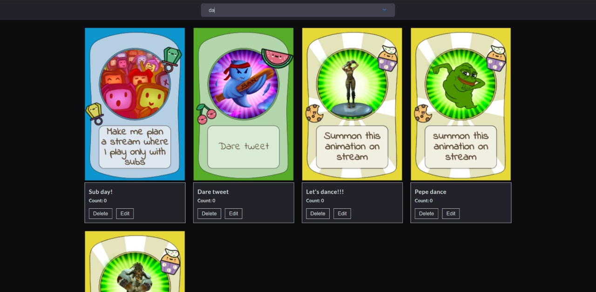

# [Streamloots - Frontend Challenge](https://www.streamloots.com/)



## Table of content

- [Description](#description)
- [Installation](#installation)
- [Technologies](#technologies)
- [Todos](#Todos)
- [Contact](#contact)

## Description

This is the frontend challenge provided by Streamloots. The task iso create a Single Page Application with React + Redux + redux-saga / redux-thunks.
The challenge consists in a Single Page Application with a list of cards. The cards should
be retrieved from a JSON remotely accessible from the Internet.

More information can be found [here](https://drive.google.com/file/d/1jI85SPfMi-Fk8MMMieSSIcQxlOdeNu4X/view?usp=sharing)

## Installation

1. Clone the project to your local directory

```
git clone https://github.com/KaushikShivam/sl-challenge
```

2. The project uses NPM for managing dependencies. Run npm install to install all the required dependencies

```
npm install
```

3. Run the local json server

```
npm run json-server
```

4. Run the project

```
npm start
```

## Technologies

- Frontend
  `React`, `Redux`, `Thunks`, `SASS`, `Typescript`, `Pagination`, `Inifinite Scroll`, `JSON-SERVER`, `Performace`, `Chunking & Splitting`, `Error Boundary`
- Testing
  `Jest`, `Enzyme`, `Moxios`,

## Todos

Due to the time constraints, these are the things that I left out that I feel could be impliemented further in the project.

- [ ] More test coverage, especially E2E using cypress
- [ ] Use React Query instead of redux for cards fetching, storing & persisting, and especially caching
- [ ] CI/CD pipeline + deployment

## Contact

You can contact me at:

- [Portfolio](www.shivamkaushik.com)
- [Email](shivamkaushikofficial@gmail.com)
- [Linkedin](https://www.linkedin.com/in/kshivamdev/)
- [Twitter](https://twitter.com/kShivamDev)
- [Medium](https://medium.com/@shivamkaushikofficial)
- [Angellist](https://angel.co/kshivamdev)
